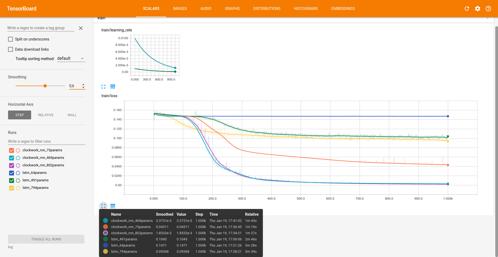
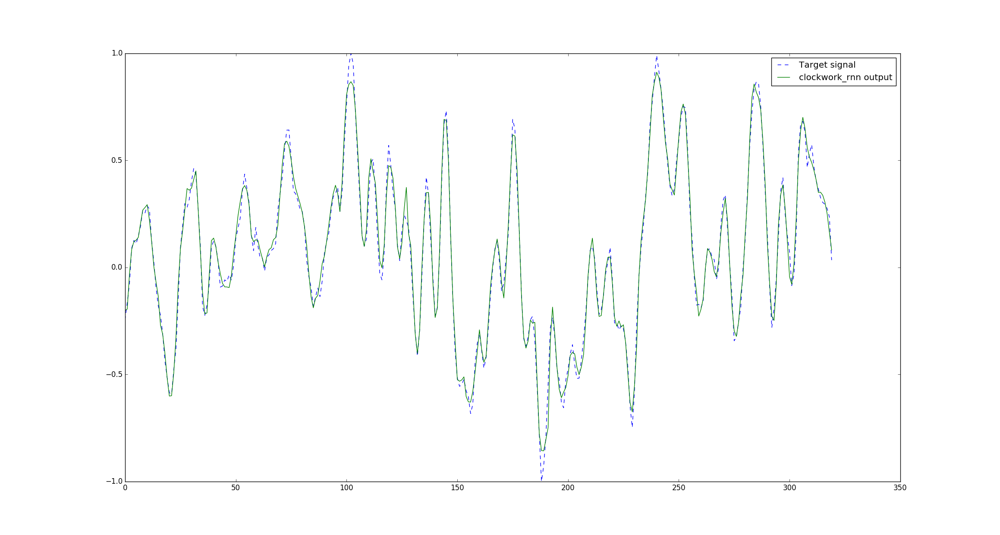

# Clockwork RNN

This project is an implementation of the Clockwork RNN
(see [paper](https://arxiv.org/abs/1402.3511)).

### People : Paul Mustière, Pandav2 aka David Panou
### Organization : UPMC - Master Data Science

## Clockwork-RNN

The model can be found under `models/clockwork_rnn.py`.

The current `main.py` replicates the sequence generation task
described in the paper, but the implementation should be able
to handle other tasks.

To monitor the training, you can use TensorBoard:
```
tensorboard --reload_interval 2 --logdir log
```

## Results

We ran different sizes of Clockwork RNN as well as LSTMs to compare performance
with similar numbers of parameters.

The following table summarizes the results:

| Number of parameters | Clockwork RNN (MSE) | LSTM (MSE) |
|:--------------------:|:-------------------:|------------|
|          ~70         |        4.3e-2       | 1.5e-1     |
|         ~480         |        3.4e-3       | 1.0e-1     |
|         ~800         |        1.8e-3       | 9.3e-2     |

They were obtained with a learning rate of 0.01 for Clockwork RNN,
and 0.001 for LSTM (which was more unstable).

The following graph shows the MSE loss during training:



The following plot shows the generated signal (and the target)
for the best performing Clockwork RNN:



Generated signals for other models can be found under `results/`
